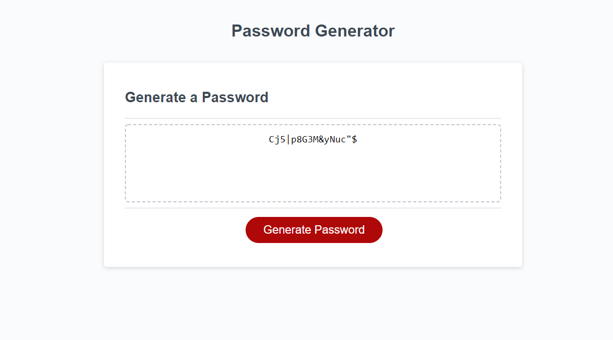

### Javascript Password Generator

## Page Description
This page hosts a password generator.  The user clicks the Generate Password button and then answers a series of prompts about the password requirements.  The script validates the requirements provided and generates a password for the user in the box on the screen. This page and script were created as a challenge assignment for a full-stack web developer bootcamp.  

CAUTION: This generator is only pseudo-random.  Do not use this password generator to generate passwords for real log-in information.

## Page Link
This page is hosted at https://kpehl.github.io/password-generator/Develop/

## Screenshot
